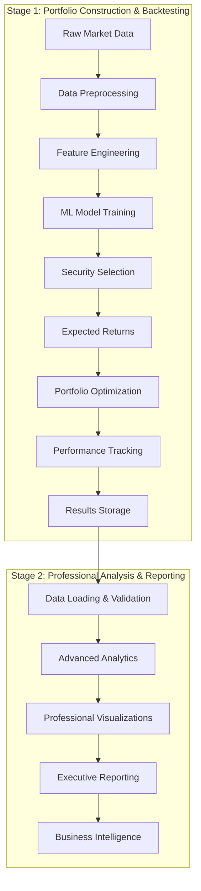

# Technical Reference - MTUM Replica Portfolio System

## Table of Contents
1. [System Architecture](#system-architecture)
2. [Two-Stage Pipeline Design](#two-stage-pipeline-design)
3. [Core Modules](#core-modules)
4. [Mathematical Framework](#mathematical-framework)
5. [Data Structures](#data-structures)
6. [Performance Optimization](#performance-optimization)
7. [Extension Points](#extension-points)
8. [Testing Framework](#testing-framework)

## System Architecture

### High-Level Two-Stage Design

The system follows a modular, two-stage architecture designed for scalability, maintainability, and professional presentation:



### Enhanced Component Dependencies

```python
# Stage 1: Portfolio Construction Pipeline
jd_assignment2.ipynb
├── xgb_portfolio_model.py           # ML-based security selection
├── expected_returns_models.py       # Ex-ante returns calculation
├── portfolio_optimization.py        # CVXPY optimization engine
├── backtest_storage.py             # Performance tracking and storage
├── portfolio_performance_summary.py # Performance analysis
└── portfolio_precleaning.py        # Data cleaning and preprocessing

# Stage 2: Professional Analysis Pipeline
mtum_analysis.ipynb
└── mtum_analysis_toolkit.py        # Complete analysis and reporting toolkit
    ├── Data Loading Functions
    ├── Visualization Engine
    ├── Executive Summary Generator
    ├── Professional Reporting System
    └── Business Intelligence Module
```

## Two-Stage Pipeline Design

### Stage 1: Portfolio Construction & Backtesting

**Purpose**: Systematic portfolio construction using ML and optimization
**Execution**: `jd_assignment2.ipynb` (Jupyter notebook)
**Output**: Timestamped results directories with comprehensive backtest data

**Technical Flow**:
```python
Raw Data → Feature Engineering → ML Prediction → Portfolio Optimization → Performance Tracking
    ↓              ↓                    ↓                     ↓                    ↓
parquet        momentum           XGBoost              CVXPY              CSV/PKL files
files        volatility         classifier          optimization        organized results
            correlation        predictions          weights            directory structure
```

### Stage 2: Professional Analysis & Reporting

**Purpose**: Professional analysis, visualization, and business intelligence
**Execution**: `mtum_analysis.ipynb` (Jupyter notebook)
**Input**: Stage 1 backtest results (auto-detected)
**Output**: Executive reports, professional charts, business conclusions

**Technical Flow**:
```python
Backtest Results → Data Loading → Advanced Analytics → Professional Reports
       ↓               ↓              ↓                    ↓
CSV/PKL files    Automatic file    Executive summary    Markdown reports
Excel exports    discovery and     Professional         Excel exports
Chart files      validation        visualizations      Business intelligence
```

## Core Modules

### Stage 1 Modules

#### 1. XGBoost Portfolio Model (`xgb_portfolio_model.py`)

**Technical Specifications**:
- **Algorithm**: XGBoost binary classification with hyperparameter optimization
- **Cross-Validation**: TimeSeriesSplit with 3 folds to prevent look-ahead bias
- **Feature Space**: 9-dimensional momentum, volatility, and correlation features
- **Target Variable**: Binary inclusion based on optimization-derived labels

**Architecture**:
```python
class XGBoostPortfolioClassifier:
    """
    Technical implementation of XGBoost for portfolio security selection.
    
    Key Components:
    - Hyperparameter grid search across 7 parameters
    - Time-series aware cross-validation
    - Feature importance analysis
    - Prediction probability calibration
    """
    
    def __init__(self, param_grid=None, cv_folds=3):
        self.param_grid = param_grid or DEFAULT_XGBOOST_PARAMS
        self.cv_folds = cv_folds
        self.model = None
        self.feature_importance = None
    
    def train(self, X, y, feature_names):
        """Train with time-series cross-validation."""
        pass
    
    def predict_proba(self, X):
        """Generate prediction probabilities for portfolio inclusion."""
        pass
```

#### 2. Expected Returns Models (`expected_returns_models.py`)

**Technical Implementation**:
- **Multi-Factor Model**: Combines momentum, mean reversion, and risk factors
- **Shrinkage Estimation**: James-Stein estimator for robust parameter estimation
- **Risk Adjustment**: Incorporates volatility forecasts and correlation structure

**Mathematical Framework**:
```python
def build_factor_model_returns(returns_matrix, method='multi_factor'):
    """
    Technical implementation of factor-based expected returns.
    
    Mathematical Model:
    E[R_i] = α + β_momentum × MOM_i + β_reversion × REV_i + β_vol × VOL_i
    
    Where:
    - MOM_i: Security-specific momentum factor
    - REV_i: Mean reversion component  
    - VOL_i: Volatility risk adjustment
    - Coefficients estimated via cross-sectional regression
    """
```

#### 3. Portfolio Optimization (`portfolio_optimization.py`)

**Technical Architecture**:
- **Optimization Engine**: CVXPY with multiple solver support (ECOS, SCS, OSQP)
- **Objective Function**: Mean-variance optimization with L1 regularization
- **Constraint System**: Long-only, weight limits, position count constraints

**Mathematical Formulation**:
```python
def optimize_portfolio_cvxpy(expected_returns, covariance_matrix, **kwargs):
    """
    Technical implementation of portfolio optimization.
    
    Optimization Problem:
    minimize: w^T Σ w - λ μ^T w + γ ||w||_1
    subject to:
        1^T w = 1                    (budget constraint)
        0 ≤ w_i ≤ w_max             (position limits)
        ||w||_0 ≤ K                 (cardinality constraint via L1)
        
    Where:
    - w: portfolio weights vector
    - Σ: covariance matrix
    - μ: expected returns vector
    - λ: risk aversion parameter
    - γ: L1 penalty parameter
    """
```

#### 4. Backtest Storage (`backtest_storage.py`)

**Data Architecture**:
```python
class BacktestResultsStorage:
    """
    Technical data management system for backtest results.
    
    Storage Structure:
    - Monthly optimization results (Dict → CSV)
    - Daily performance data (DataFrame → CSV)
    - Portfolio weights history (Nested Dict → PKL)
    - Transaction cost analysis (Dict → CSV)
    - Model performance metrics (Dict → CSV)
    """
    
    def __init__(self, start_date, end_date, benchmark_name):
        self.data_store = {
            'monthly_results': [],
            'daily_performance': pd.DataFrame(),
            'portfolio_weights': {},
            'transaction_costs': [],
            'model_metrics': []
        }
```

### Stage 2 Module

#### 5. MTUM Analysis Toolkit (`mtum_analysis_toolkit.py`)

**Technical Architecture**:
- **Modular Design**: Seven functional categories with 20+ specialized functions
- **Automatic Discovery**: Smart file pattern matching and data loading
- **Professional Visualization**: matplotlib/seaborn with publication-quality styling
- **Report Generation**: Automated markdown and Excel export capabilities

**Key Technical Components**:

```python
class MTUMAnalysisEngine:
    """
    Technical implementation of professional analysis toolkit.
    
    Core Components:
    1. Data Loading Engine - Pattern-based file discovery
    2. Analytics Engine - Performance metrics calculation
    3. Visualization Engine - Professional chart generation
    4. Reporting Engine - Automated report creation
    5. Business Intelligence - Conclusion generation
    """
    
    def __init__(self, auto_detect=True):
        self.data_cache = {}
        self.analysis_results = {}
        self.chart_configs = DEFAULT_CHART_CONFIGS
    
    def load_all_data(self):
        """Technical implementation of automatic data loading."""
        pass
    
    def generate_executive_summary(self, data):
        """Advanced analytics for executive summary generation.""" 
        pass
```

**Data Loading Architecture**:
```python
def find_csv_files_smart():
    """
    Technical implementation of intelligent file discovery.
    
    Algorithm:
    1. Search for latest backtest directory (timestamp-based)
    2. Attempt structured subdirectory discovery
    3. Fallback to flat directory pattern matching
    4. Content-based file classification
    5. Validation and error handling
    """
```

**Visualization Engine**:
```python
class ProfessionalVisualizationEngine:
    """
    Technical implementation of publication-quality visualizations.
    
    Features:
    - Consistent styling with seaborn-v0_8
    - Dynamic scaling based on data characteristics
    - Automatic annotation and labeling
    - Export-ready formatting (300 DPI, vector graphics)
    """
```

## Mathematical Framework

### Feature Engineering

**Momentum Calculations** (Academic Standard):
```
Momentum_k = ln(P_{t-1} / P_{t-k-1})

Implemented Features:
- mom_change_1m_lag:  ln(P_1M / P_2M)
- mom_change_3m_lag:  ln(P_1M / P_4M) 
- mom_change_6m_lag:  ln(P_1M / P_7M)
- mom_change_12m_lag: ln(P_1M / P_13M)
```

**Volatility Estimation**:
```
Daily Returns: R_t = ln(P_t / P_{t-1})
Rolling Volatility: σ_N = std(R_{t-N:t}) × √252

Implemented Features:
- rolling_std_20d: 20-day rolling standard deviation
- rolling_std_60d: 60-day rolling standard deviation
- annualized_rolling_std_*: Annualized volatility measures
```

**Correlation Analysis**:
```
Rolling Correlation: ρ_N = Cov(R_security, R_MTUM) / (σ_security × σ_MTUM)

Implemented Features:
- rolling_60d_corr: 60-day rolling correlation with MTUM
```

### Portfolio Optimization Framework

**Objective Function**:
```
minimize: w^T Σ w - λ μ^T w + γ ||w||_1

Components:
- Risk Term: w^T Σ w (portfolio variance)
- Return Term: λ μ^T w (expected return, risk-adjusted)
- Sparsity Term: γ ||w||_1 (L1 penalty for fewer positions)
```

**Constraint System**:
```
Budget Constraint:    Σw_i = 1
Non-negativity:      w_i ≥ 0 ∀i
Position Limits:     w_i ≤ w_max ∀i
Minimum Position:    w_i ≥ w_min if w_i > 0
Cardinality:         ||w||_0 ≤ K (enforced via L1 penalty)
```

## Data Structures

### Stage 1 Data Flow

**Feature Matrix Structure**:
```python
feature_data: pd.DataFrame
    Columns: ['Date', 'Ticker'] + FEATURE_COLUMNS
    Index: MultiIndex(Date, Ticker) or RangeIndex
    Shape: (n_observations, n_features + 2)
    
    FEATURE_COLUMNS = [
        'mom_change_1m_lag',          # float64
        'mom_change_3m_lag',          # float64  
        'mom_change_6m_lag',          # float64
        'mom_change_12m_lag',         # float64
        'rolling_std_20d',            # float64
        'rolling_std_60d',            # float64
        'annualized_rolling_std_20d', # float64
        'annualized_rolling_std_60d', # float64
        'rolling_60d_corr'            # float64
    ]
```

**Portfolio Weights Structure**:
```python
portfolio_weights: pd.DataFrame
    Columns: ['Security', 'Weight']
    Index: RangeIndex  
    Shape: (n_securities, 2)
    
    Constraints:
    - weights['Weight'].sum() ≈ 1.0
    - weights['Weight'] ≥ 0.0
    - len(weights) ≤ max_positions
```

**Performance Metrics Structure**:
```python
performance_metrics: Dict
    {
        'portfolio_return': float,      # Annualized return
        'benchmark_return': float,      # Benchmark annualized return
        'tracking_error': float,        # Annualized tracking error
        'information_ratio': float,     # Information ratio
        'sharpe_ratio': float,         # Portfolio Sharpe ratio
        'beta': float,                 # Portfolio beta vs benchmark
        'alpha': float,                # Portfolio alpha (annualized)
        'max_drawdown': float,         # Maximum drawdown
        'correlation': float           # Correlation with benchmark
    }
```

### Stage 2 Data Structures

**Analysis Data Dictionary**:
```python
analysis_data: Dict[str, pd.DataFrame]
    {
        'benchmark_comparison': pd.DataFrame,  # Monthly performance metrics
        'daily_returns': pd.DataFrame,         # Daily return series
        'portfolio_composition': pd.DataFrame, # Portfolio characteristics
        'portfolio_weights': pd.DataFrame,     # Weight history
        'transaction_costs': pd.DataFrame,     # Transaction cost analysis
        'prediction_accuracy': pd.DataFrame    # ML model performance
    }
```

**Executive Summary Structure**:
```python
summary_metrics: Dict
    {
        'start_date': pd.Timestamp,           # Analysis period start
        'end_date': pd.Timestamp,             # Analysis period end
        'period_years': float,                # Duration in years
        'period_days': int,                   # Duration in days
        'portfolio_return': float,            # Annualized portfolio return
        'benchmark_return': float,            # Annualized benchmark return
        'excess_return': float,               # Excess return
        'tracking_error': float,              # Tracking error
        'info_ratio': float,                  # Information ratio
        'sharpe_ratio': float,                # Sharpe ratio
        'beta': float,                        # Beta
        'alpha': float,                       # Alpha
        'avg_holdings': float,                # Average holdings count
        'concentration': float,               # Average concentration
        'avg_turnover': float,                # Average turnover
        'avg_cost_bps': float,               # Average cost (bps)
        'model_accuracy': float,              # ML accuracy
        'model_f1': float                     # ML F1 score
    }
```

## Performance Optimization

### Stage 1 Optimizations

**Bulk Processing Mode**:
```python
# Memory-efficient processing for long backtests
OPTIMIZATION_CONFIG = {
    'BULK_MODE': True,                    # Minimize memory usage
    'SAVE_MONTHLY_CHARTS': False,        # Skip chart generation
    'CHECKPOINT_EVERY_N_MONTHS': 24,     # Periodic saves
    'MINIMAL_LOGGING': True              # Reduce log overhead
}
```

**Numerical Optimization**:
```python
# CVXPY solver configuration for performance
SOLVER_CONFIG = {
    'solver': 'ECOS',                    # Fast first-order solver
    'max_iters': 1000,                   # Iteration limit
    'abstol': 1e-6,                      # Absolute tolerance
    'reltol': 1e-6,                      # Relative tolerance
    'verbose': False                     # Disable solver output
}
```

### Stage 2 Optimizations

**Caching Strategy**:
```python
class DataCacheManager:
    """
    Technical implementation of data caching for Stage 2 analysis.
    
    Features:
    - In-memory caching of loaded datasets
    - Lazy loading with automatic cache invalidation
    - Memory-efficient DataFrame operations
    """
    
    def __init__(self, max_cache_size_mb=1024):
        self.cache = {}
        self.max_size = max_cache_size_mb * 1024 * 1024
        self.current_size = 0
```

**Visualization Optimization**:
```python
# Chart generation optimization
CHART_CONFIG = {
    'style': 'seaborn-v0_8',            # Efficient style
    'figure_size': (12, 8),             # Standard size
    'dpi': 300,                         # High resolution
    'format': 'png',                    # Efficient format
    'bbox_inches': 'tight'              # Optimal layout
}
```

## Extension Points

### Custom Expected Returns Models

```python
def custom_expected_returns_model(returns_matrix, **kwargs):
    """
    Template for implementing custom expected returns models.
    
    Technical Requirements:
    - Input: Wide-format returns matrix (dates × securities)
    - Output: Series of expected returns (annualized)
    - Must handle missing data gracefully
    - Should return model diagnostics in second return value
    """
    expected_returns = pd.Series(index=returns_matrix.columns)
    model_diagnostics = {}
    
    # Custom implementation here
    
    return expected_returns, model_diagnostics
```

### Custom Optimization Objectives

```python
def custom_optimization_objective(w, expected_returns, cov_matrix, **kwargs):
    """
    Template for implementing custom optimization objectives.
    
    Technical Requirements:
    - Input: CVXPY variable w, expected returns, covariance matrix
    - Output: CVXPY expression for objective function
    - Must be compatible with CVXPY DCP rules
    """
    import cvxpy as cp
    
    # Custom objective implementation
    risk_term = cp.quad_form(w, cov_matrix)
    return_term = expected_returns.T @ w
    custom_term = 0  # Add custom terms here
    
    return risk_term - return_term + custom_term
```

### Custom Analysis Functions

```python
def custom_analysis_function(data: Dict[str, pd.DataFrame]) -> None:
    """
    Template for implementing custom analysis functions.
    
    Technical Requirements:
    - Input: Standard analysis data dictionary
    - Output: Can print results, save files, or return values
    - Should handle missing data gracefully
    - Follow existing naming conventions
    """
    if 'benchmark_comparison' not in data:
        print("⚠️ Benchmark comparison data not available")
        return
    
    # Custom analysis implementation
    bc = data['benchmark_comparison']
    
    # Example: Custom metric calculation
    custom_metric = bc['some_column'].mean()
    print(f"Custom Metric: {custom_metric:.3f}")
```

## Testing Framework

### Unit Testing Architecture

```python
import unittest
import pandas as pd
import numpy as np
from portfolio_optimization import optimize_portfolio_cvxpy

class TestPortfolioOptimization(unittest.TestCase):
    """Technical test framework for portfolio optimization module."""
    
    def setUp(self):
        """Setup test data with known characteristics."""
        np.random.seed(42)
        n_securities = 5
        
        # Generate synthetic expected returns
        self.mean_returns = pd.Series(
            np.random.normal(0.08, 0.02, n_securities),
            index=[f'ETF_{i}' for i in range(n_securities)]
        )
        
        # Generate positive definite covariance matrix
        random_matrix = np.random.randn(n_securities, n_securities)
        self.cov_matrix = pd.DataFrame(
            random_matrix @ random_matrix.T / 252,
            index=self.mean_returns.index,
            columns=self.mean_returns.index
        )
        
    def test_optimization_basic_constraints(self):
        """Test basic optimization constraints are satisfied."""
        weights_df, ret, vol, sharpe, status = optimize_portfolio_cvxpy(
            self.mean_returns, self.cov_matrix
        )
        
        # Verify solution quality
        self.assertIsNotNone(weights_df)
        self.assertEqual(status, 'optimal')
        self.assertAlmostEqual(weights_df['Weight'].sum(), 1.0, places=6)
        self.assertTrue((weights_df['Weight'] >= 0).all())
    
    def test_l1_penalty_sparsity_effect(self):
        """Test L1 penalty creates portfolio sparsity."""
        # High L1 penalty should create fewer positions
        weights_high_l1, _, _, _, _ = optimize_portfolio_cvxpy(
            self.mean_returns, self.cov_matrix, l1_penalty=0.1
        )
        
        # Low L1 penalty should create more positions  
        weights_low_l1, _, _, _, _ = optimize_portfolio_cvxpy(
            self.mean_returns, self.cov_matrix, l1_penalty=0.001
        )
        
        # Verify sparsity effect
        self.assertLess(len(weights_high_l1), len(weights_low_l1))
        
    def test_risk_aversion_effect(self):
        """Test risk aversion parameter affects portfolio risk."""
        # High risk aversion should create lower risk portfolio
        _, _, vol_high_ra, _, _ = optimize_portfolio_cvxpy(
            self.mean_returns, self.cov_matrix, risk_aversion=5.0
        )
        
        # Low risk aversion should create higher risk portfolio
        _, _, vol_low_ra, _, _ = optimize_portfolio_cvxpy(
            self.mean_returns, self.cov_matrix, risk_aversion=0.5
        )
        
        # Verify risk aversion effect
        self.assertLess(vol_high_ra, vol_low_ra)

class TestMTUMAnalysisToolkit(unittest.TestCase):
    """Technical test framework for analysis toolkit."""
    
    def setUp(self):
        """Setup test data for analysis functions."""
        # Create synthetic analysis data
        dates = pd.date_range('2023-01-01', '2023-12-31', freq='D')
        
        self.test_data = {
            'benchmark_comparison': pd.DataFrame({
                'Date': dates[:12],  # Monthly data
                'Portfolio_Annual_Return': np.random.normal(0.10, 0.02, 12),
                'Benchmark_Annual_Return': np.random.normal(0.08, 0.02, 12),
                'Tracking_Error': np.random.normal(0.04, 0.01, 12)
            }),
            'daily_returns': pd.DataFrame({
                'Date': dates,
                'Portfolio_Return': np.random.normal(0.0004, 0.01, len(dates)),
                'Benchmark_Return': np.random.normal(0.0003, 0.01, len(dates))
            })
        }
    
    def test_executive_summary_generation(self):
        """Test executive summary generates required metrics."""
        import mtum_analysis_toolkit as mtum
        
        summary = mtum.generate_executive_summary(self.test_data)
        
        # Verify required fields
        required_fields = [
            'start_date', 'end_date', 'period_years',
            'portfolio_return', 'benchmark_return', 'tracking_error'
        ]
        for field in required_fields:
            self.assertIn(field, summary)
            
    def test_data_loading_robustness(self):
        """Test data loading handles various file structures."""
        import mtum_analysis_toolkit as mtum
        
        # Test should not crash with empty directory
        # (Implementation depends on actual file structure)
        pass

if __name__ == '__main__':
    unittest.main()
```

### Integration Testing

```python
class TestEndToEndWorkflow(unittest.TestCase):
    """Technical integration tests for complete workflow."""
    
    def test_stage1_to_stage2_data_flow(self):
        """Test data flows correctly from Stage 1 to Stage 2."""
        # This would test the complete pipeline
        # from raw data through to final reports
        pass
    
    def test_performance_benchmarks(self):
        """Test system performance meets technical benchmarks."""
        # Benchmark tests for execution time, memory usage
        pass
```

This comprehensive technical reference provides detailed documentation of the system's architecture, mathematical foundations, data structures, and extension points for developers and quantitative researchers working with the MTUM replica portfolio system.